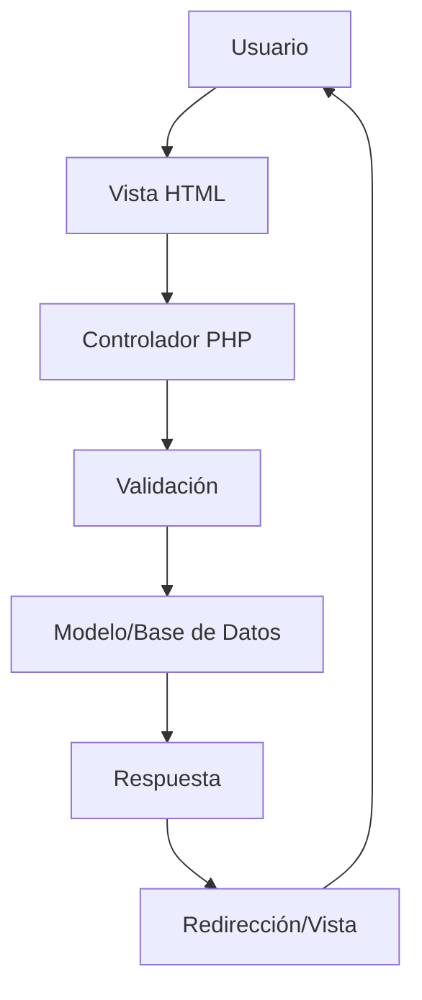

# 📦 Sistema de Inventario PHP - CRUD Completo

[](https://php.net)
[](https://mysql.com)
[](LICENSE)
[](https://github.com/tu-usuario/php-crud-inventory)

> 🚀 Sistema completo de gestión de inventario desarrollado en PHP puro con arquitectura MVC, diseñado para pequeñas y medianas empresas que necesitan controlar sus productos, categorías y usuarios de manera eficiente y segura.

## 📋 Tabla de Contenidos

- [🌟 Características](#-características)
- [🛠️ Tecnologías Utilizadas](#️-tecnologías-utilizadas)
- [📸 Capturas de Pantalla](#-capturas-de-pantalla)
- [⚙️ Requisitos del Sistema](#️-requisitos-del-sistema)
- [🚀 Instalación y Configuración](#-instalación-y-configuración)
- [🏗️ Arquitectura del Proyecto](#️-arquitectura-del-proyecto)
- [📊 Base de Datos](#-base-de-datos)
- [🔧 Configuración Avanzada](#-configuración-avanzada)
- [📖 Manual de Usuario](#-manual-de-usuario)
- [🧪 Testing](#-testing)
- [🤝 Contribución](#-contribución)
- [🗺️ Roadmap](#️-roadmap)
- [❓ Solución de Problemas](#-solución-de-problemas)
- [📝 Changelog](#-changelog)
- [📄 Licencia](#-licencia)
- [👨‍💻 Autor](#-autor)

## 🌟 Características

### ✨ Funcionalidades Principales

- **CRUD Completo**: Operaciones Create, Read, Update, Delete para productos, categorías y usuarios
- **Gestión de Imágenes**: Sistema de carga y administración de imágenes para productos con validación de tipos y tamaños
- **Autenticación Segura**: Hash de contraseñas con PHP password_hash() y validaciones robustas
- **Paginación Inteligente**: Sistema de paginación configurable para mejorar el rendimiento
- **Búsqueda y Filtros**: Capacidades de búsqueda y filtrado en tiempo real
- **Responsive Design**: Interfaz adaptativa que funciona en dispositivos móviles y desktop
- **Validación de Datos**: Validaciones tanto del lado del cliente como del servidor
- **Gestión de Errores**: Sistema robusto de manejo de errores y mensajes informativos

### 🔒 Características de Seguridad

- **Prevención de SQL Injection**: Uso exclusivo de prepared statements
- **Validación de Tipos de Archivo**: Control estricto de formatos de imagen permitidos
- **Sanitización de Entrada**: Limpieza de todos los datos de entrada del usuario
- **Gestión Segura de Sesiones**: Implementación de mejores prácticas de sesiones PHP
- **Control de Acceso**: Sistema de permisos básico para diferentes tipos de usuarios

### 🎨 Experiencia de Usuario

- **Interfaz Intuitiva**: Diseño limpio y fácil de navegar
- **Mensajes Contextuales**: Feedback inmediato para todas las acciones del usuario
- **Confirmaciones de Eliminación**: Páginas de confirmación para prevenir eliminaciones accidentales
- **Breadcrumbs**: Navegación clara y orientación dentro del sistema

## 🛠️ Tecnologías Utilizadas

### Backend
- **PHP 7.4+**: Lenguaje principal del servidor
- **MySQL 8.0+**: Sistema de gestión de base de datos
- **PDO/MySQLi**: Abstracción de base de datos con prepared statements

### Frontend
- **HTML5**: Estructura semántica moderna
- **CSS3**: Estilos personalizados con Flexbox y Grid
- **JavaScript (Vanilla)**: Interactividad del lado del cliente
- **Responsive Design**: Compatible con dispositivos móviles

### Arquitectura
- **MVC Pattern**: Separación clara de responsabilidades
- **RESTful Design**: Principios REST para la organización de rutas
- **File Organization**: Estructura de carpetas escalable y mantenible

## 📸 Capturas de Pantalla

> 📝 **Nota**: Las capturas de pantalla se agregarán en la próxima actualización del README.

```bash
# Directorio para capturas de pantalla
docs/
├── screenshots/
│   ├── dashboard.png
│   ├── products-list.png
│   ├── product-form.png
│   └── categories-management.png
```

## ⚙️ Requisitos del Sistema

### Requisitos Mínimos

| Componente | Versión Mínima | Versión Recomendada |
|------------|----------------|---------------------|
| PHP        | 7.4           | 8.0+               |
| MySQL      | 5.7           | 8.0+               |
| Apache     | 2.4           | 2.4+               |
| Memoria RAM| 512 MB        | 1 GB+              |
| Espacio    | 100 MB        | 500 MB+            |

### Extensiones PHP Requeridas

```bash
# Verificar extensiones instaladas
php -m | grep -E "(mysqli|pdo|gd|fileinfo|mbstring)"
```

- `mysqli` o `pdo_mysql`: Conexión a MySQL
- `gd`: Manipulación de imágenes
- `fileinfo`: Detección de tipos MIME
- `mbstring`: Manejo de cadenas multibyte
- `json`: Procesamiento de datos JSON

## 🚀 Instalación y Configuración

### 1. Clonar el Repositorio

```bash
# Clonar el proyecto
git clone https://github.com/tu-usuario/php-crud-inventory.git

# Navegar al directorio
cd php-crud-inventory

# Verificar la estructura
ls -la
```

### 2. Configuración del Servidor Web

#### Opción A: XAMPP/WAMP (Desarrollo Local)

```bash
# Mover el proyecto a la carpeta htdocs
cp -r php-crud-inventory /xampp/htdocs/

# Acceder desde el navegador
http://localhost/php-crud-inventory
```

#### Opción B: Servidor Apache en Producción

```apache
# Configuración del VirtualHost (/etc/apache2/sites-available/inventory.conf)
<VirtualHost *:80>
    ServerName tu-dominio.com
    DocumentRoot /var/www/php-crud-inventory
    
    <Directory /var/www/php-crud-inventory>
        AllowOverride All
        Require all granted
    </Directory>
    
    ErrorLog ${APACHE_LOG_DIR}/inventory_error.log
    CustomLog ${APACHE_LOG_DIR}/inventory_access.log combined
</VirtualHost>
```

### 3. Configuración de la Base de Datos

```sql
-- 1. Crear la base de datos
CREATE DATABASE inventario_sistema CHARACTER SET utf8mb4 COLLATE utf8mb4_unicode_ci;

-- 2. Crear usuario (opcional pero recomendado)
CREATE USER 'inventario_user'@'localhost' IDENTIFIED BY 'tu_contraseña_segura';
GRANT ALL PRIVILEGES ON inventario_sistema.* TO 'inventario_user'@'localhost';
FLUSH PRIVILEGES;

-- 3. Importar el esquema
USE inventario_sistema;
SOURCE database/schema.sql;
```

### 4. Configuración de Archivos PHP

```bash
# 1. Copiar archivos de configuración de ejemplo
cp config/config.example.php config/config.php
cp config/conexion.example.php config/conexion.php

# 2. Editar config.php con tus datos
nano config/config.php
```

**Configuración típica para desarrollo local:**

```php
// config/config.php
define('DB_HOST', 'localhost');
define('DB_USER', 'inventario_user');
define('DB_PASS', 'tu_contraseña_segura');
define('DB_NAME', 'inventario_sistema');
define('BASE_URL', 'http://localhost/php-crud-inventory/');
```

### 5. Configuración de Permisos

```bash
# Dar permisos de escritura a la carpeta uploads
chmod 755 uploads/
chown -R www-data:www-data uploads/

# Verificar permisos
ls -la uploads/
```

### 6. Verificación de la Instalación

Visita `http://tu-dominio.com/` y deberías ver:
- ✅ Dashboard principal
- ✅ Menú de navegación funcional
- ✅ Contadores de productos y categorías
- ✅ Sin errores en los logs

## 🏗️ Arquitectura del Proyecto

### Patrón MVC Implementado

```
📁 php-crud-inventory/
├── 📁 config/           # Configuración global y conexiones
├── 📁 controllers/      # Lógica de negocio y procesamiento
├── 📁 views/           # Interfaces de usuario (HTML + PHP)
├── 📁 models/          # Modelos de datos (futuras implementaciones)
├── 📁 assets/          # Recursos estáticos (CSS, JS, imágenes)
├── 📁 database/        # Esquemas y migraciones de BD
├── 📁 uploads/         # Archivos subidos por usuarios
├── 📁 includes/        # Archivos de utilidades y helpers
└── 📁 tests/          # Tests unitarios y de integración
```

### Flujo de Datos



### Convenciones de Nomenclatura

- **Archivos**: `snake_case.php` (ejemplo: `producto_listar.php`)
- **Variables**: `$snake_case` (ejemplo: `$producto_id`)
- **Constantes**: `UPPER_CASE` (ejemplo: `DB_HOST`)
- **Clases**: `PascalCase` (para futuras implementaciones)
- **Funciones**: `camelCase` o `snake_case`

## 📊 Base de Datos

### Diagrama de Entidad-Relación

```
┌─────────────┐       ┌─────────────┐       ┌─────────────┐
│   usuario   │       │  producto   │       │ categoria   │
├─────────────┤       ├─────────────┤       ├─────────────┤
│ usuario_id  │◄─────►│ usuario_id  │       │categoria_id │◄─┐
│usuario_nombre│       │producto_id  │       │categoria_   │  │
│usuario_apellido│     │producto_codigo│     │   nombre    │  │
│usuario_usuario│      │producto_nombre│     │categoria_   │  │
│usuario_clave │       │producto_precio│     │ ubicacion   │  │
│usuario_email │       │producto_stock │     └─────────────┘  │
└─────────────┘       │producto_foto  │                      │
                      │categoria_id   │◄─────────────────────┘
                      └─────────────┘
```

### Índices y Optimizaciones

```sql
-- Índices para mejorar el rendimiento
CREATE INDEX idx_producto_codigo ON producto(producto_codigo);
CREATE INDEX idx_usuario_email ON usuario(usuario_email);
CREATE INDEX idx_categoria_nombre ON categoria(categoria_nombre);

-- Índices de claves foráneas
CREATE INDEX fk_producto_categoria ON producto(categoria_id);
CREATE INDEX fk_producto_usuario ON producto(usuario_id);
```

## 🔧 Configuración Avanzada

### Variables de Entorno

Para proyectos en producción, considera usar variables de entorno:

```bash
# .env (no incluir en Git)
DB_HOST=localhost
DB_USER=production_user
DB_PASS=super_secure_password
DB_NAME=inventory_prod
APP_ENV=production
DEBUG_MODE=false
```

### Configuración de Seguridad

```php
// Configuraciones adicionales de seguridad
ini_set('session.cookie_httponly', 1);
ini_set('session.use_only_cookies', 1);
ini_set('session.cookie_secure', 1); // Solo para HTTPS

// Headers de seguridad
header('X-Content-Type-Options: nosniff');
header('X-Frame-Options: DENY');
header('X-XSS-Protection: 1; mode=block');
```

### Optimización de Performance

```php
// config/performance.php
ini_set('memory_limit', '256M');
ini_set('max_execution_time', 30);
ini_set('upload_max_filesize', '5M');
ini_set('post_max_size', '8M');
```

## 📖 Manual de Usuario

### Gestión de Productos

1. **Agregar Producto**: Navegar a "Productos" → "Agregar Nuevo"
2. **Editar Producto**: Click en "Editar" desde la lista de productos
3. **Eliminar Producto**: Click en "Eliminar" → Confirmar acción
4. **Buscar Productos**: Usar la barra de búsqueda en la lista (Implementación futura)

### Gestión de Categorías

1. **Crear Categoría**: "Categorías" → "Agregar Nueva Categoría"
2. **Asignar Ubicación**: Especificar pasillo/estante para organización física
3. **Eliminar Categoría**: Solo posible si no tiene productos asignados

### Gestión de Usuarios

1. **Registrar Usuario**: Completar formulario con validaciones automáticas
2. **Actualizar Perfil**: Opción de cambiar contraseña opcional
3. **Control de Acceso**: Verificar productos asignados antes de eliminar

## 🧪 Testing

### Ejecutar Tests
    (Implementación futura)


### Tests Manuales Recomendados

- [ ] CRUD completo en cada módulo
- [ ] Validación de formularios
- [ ] Subida de imágenes
- [ ] Paginación
- [ ] Manejo de errores
- [ ] Seguridad (SQL injection, XSS)

## 🤝 Contribución

### Guía para Contribuidores

1. **Fork** el repositorio
2. **Crear** una rama para tu feature (`git checkout -b feature/nueva-funcionalidad`)
3. **Commit** tus cambios (`git commit -am 'Add: nueva funcionalidad'`)
4. **Push** a la rama (`git push origin feature/nueva-funcionalidad`)
5. **Crear** un Pull Request

### Estándares de Código

```php
// Ejemplo de estructura de función
/**
 * Valida los datos de entrada del producto
 * 
 * @param array $datos Datos del formulario
 * @return array Array con errores o vacío si es válido
 */
function validarProducto($datos) {
    $errores = [];
    
    if (empty($datos['nombre'])) {
        $errores[] = 'El nombre es obligatorio';
    }
    
    return $errores;
}
```

### Convenciones de Commits

```bash
# Ejemplos de mensajes de commit
git commit -m "feat: Agregar búsqueda por categoría"
git commit -m "fix: Corregir validación de imágenes"
git commit -m "docs: Actualizar documentación de API"
git commit -m "refactor: Optimizar consultas de base de datos"
```

## 🗺️ Roadmap

### Version 2.0.0 (Próxima Release)

- [ ] **Sistema de Autenticación Completo**
  - Login/logout funcional
  - Roles de usuario (admin, operador, viewer)
  - Recuperación de contraseña

- [ ] **Dashboard Avanzado**
  - Gráficos de inventario
  - Reportes en PDF
  - Alertas de stock bajo

- [ ] **API REST**
  - Endpoints JSON para integración
  - Documentación con Swagger
  - Rate limiting

### Version 2.1.0

- [ ] **Características Avanzadas**
  - Código de barras
  - Historial de movimientos
  - Importación/exportación CSV
  - Backup automático

- [ ] **Mejoras UX/UI**
  - Tema oscuro
  - Drag & drop para imágenes
  - Filtros avanzados
  - Búsqueda en tiempo real

### Version 3.0.0 (Futuro)

- [ ] **Modernización Técnica**
  - Migración a Laravel/Symfony
  - Frontend con React/Vue
  - Contenedorización con Docker
  - CI/CD con GitHub Actions

## ❓ Solución de Problemas

### Problemas Comunes

#### Error de Conexión a Base de Datos

```bash
# Verificar configuración
mysql -u tu_usuario -p tu_base_de_datos

# Revisar logs
tail -f /var/log/apache2/error.log
```

#### Problemas de Permisos en Uploads

```bash
# Verificar y corregir permisos
ls -la uploads/
sudo chown -R www-data:www-data uploads/
sudo chmod 755 uploads/
```

#### Imágenes No Se Muestran

1. Verificar que la imagen existe en `uploads/`
2. Comprobar permisos de lectura
3. Revisar la configuración de `BASE_URL`

### Logs de Debug

```php
// Agregar al config.php para debug
ini_set('log_errors', 1);
ini_set('error_log', __DIR__ . '/../logs/php_errors.log');
error_log("Debug: Variable = " . print_r($variable, true));
```

## 📝 Changelog

### [1.0.0] - 2025-05-29

#### ✨ Agregado
- Sistema CRUD completo para productos, categorías y usuarios
- Interfaz web responsive con CSS personalizado
- Sistema de validaciones del lado servidor
- Carga y gestión de imágenes para productos
- Paginación automática en listados
- Mensajes de confirmación y error contextuales
- Estructura MVC organizada y escalable

#### 🔒 Seguridad
- Prepared statements para prevenir SQL injection
- Hash seguro de contraseñas con password_hash()
- Validación de tipos de archivo para uploads
- Sanitización de entradas de usuario

#### 📚 Documentación
- README completo con guías de instalación
- Comentarios en código para facilitar mantenimiento
- Archivos de configuración de ejemplo
- Documentación de base de datos

## 📄 Licencia

Este proyecto está licenciado bajo la Licencia MIT - ver el archivo [LICENSE](LICENSE) para más detalles.

```
MIT License

Copyright (c) 2025 Jorge Padilla

Permission is hereby granted, free of charge, to any person obtaining a copy
of this software and associated documentation files (the "Software"), to deal
in the Software without restriction, including without limitation the rights
to use, copy, modify, merge, publish, distribute, sublicense, and/or sell
copies of the Software, and to permit persons to whom the Software is
furnished to do so, subject to the following conditions:

The above copyright notice and this permission notice shall be included in all
copies or substantial portions of the Software.
```

## 👨‍💻 Autor

**Jorge Luis Padilla Tirado**
- 💼 LinkedIn: [jpadillat](https://www.linkedin.com/in/jpadillat/)
- 🐙 GitHub: [@JPadillaTirado](https://github.com/JPadillaTirado)
- 📧 Email: jorgepadilla7796@gmail.com
- 🌐 Portfolio: [jorgepadilla.co](https://jorgepadilla.co/)

### 🎯 Sobre Este Proyecto

Este sistema de inventario nació de la necesidad de demostrar habilidades sólidas en desarrollo web con PHP, siguiendo las mejores prácticas de la industria. El proyecto refleja un enfoque de aprendizaje profesional en el desarrollo de software, desde la arquitectura hasta la documentación.

**Tecnologías Destacadas:**
- Implementación limpia del patrón MVC
- Seguridad robusta contra vulnerabilidades comunes
- Código mantenible y bien documentado
- Experiencia de usuario intuitiva y responsive

---

<div align="center">

**¿Te gusta este proyecto? ¡Dale una ⭐ y compártelo!**

[⬆ Volver al inicio](#-sistema-de-inventario-php---crud-completo)

</div>
